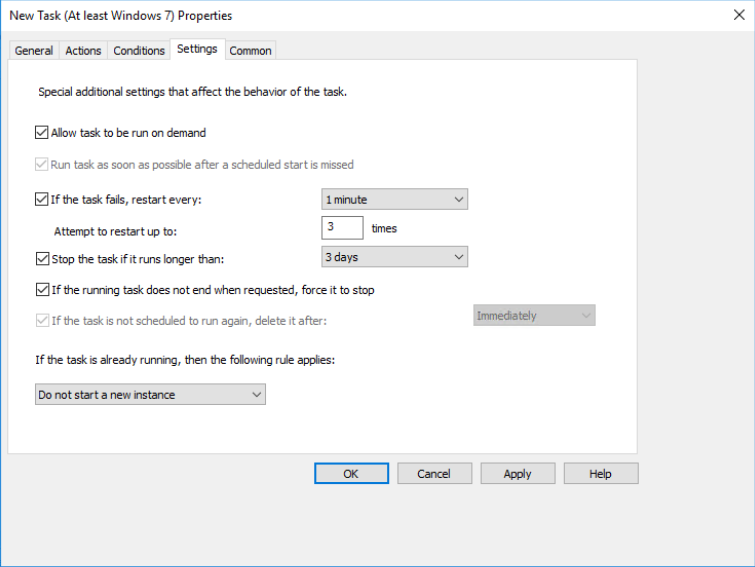

# Installing the CrowdStrike Falcon Sensor using Group Policy 

## Introduction

This guide provides step-by-step instructions for installing the CrowdStrike Falcon Sensor by using Group Policy Objects (GPOs). By following this guide, you will be able to deploy the CrowdStrike Falcon Sensor across multiple machines in your network efficiently. A Scheduled Task will be used by Group Policy to deploy the CrowdStrike Falcon Sensor.

## Requirements

- User is a Domain or Enterprise Administrator responsible for Group Policy management in their organization.
- The CrowdStrike Falcon sensor is already downloaded and stored on a network share e.g. `\\server\share\crowdstrike`. The install script that will be used will also be placed in this network share.
  > :warning: Important
  >
  > The folder and its content on the network share that contains the CrowdStrike Falcon installer and the installation script should only have the `Read & Execute` permissions set to `Everyone` to prevent unauthorized users from changing the installer and the installation script.
- Access to the Windows Group Policy Management (GPM) editor, either through the Domain Controller (DC) or through the Remote Server Administration Tools (RSAT) for Windows.
- You are familiar with Group Policy objects as well as managing Group Policy in organizations.

## Installation Script

There are a couple of ways to configure the installation script. You can either hard-code the Customer ID (CID), path to the installer and installation script, and the installer executable name, or you can pass in cli flags without having to make changes to the script.

The script is a batch (`.bat`) script is [falcon_install.bat](https://raw.githubusercontent.com/CrowdStrike/deployment-guides/refs/heads/main/microsoft/gpo/falcon_install.bat)

### Hard-coding Installation Values

1. Either download [falcon_install.bat](https://raw.githubusercontent.com/CrowdStrike/deployment-guides/refs/heads/main/microsoft/gpo/falcon_install.bat) or [copy/paste from the Appendix](#installation-batch-bat-script) to your file share e.g. `\\server\share\crowdstrike`

2. Set the `cid`, `fpath`, and `installer` values in the batch script. For example:

```bat
set cid=1234567890ABCDEF1234567890-12
set fpath=\\server\share\crowdstrike
set installer=FalconSensor_Windows.exe
```

3. Save your changes.

> [!WARNING]
> Make sure to save the [falcon_install.bat](https://raw.githubusercontent.com/CrowdStrike/deployment-guides/refs/heads/main/microsoft/gpo/falcon_install.bat) script as a `.bat` file; otherwise, the script may not run.

### Using CLI Flags

1. Either download [falcon_install.bat](https://raw.githubusercontent.com/CrowdStrike/deployment-guides/refs/heads/main/microsoft/gpo/falcon_install.bat) or [copy/paste from the Appendix](#installation-batch-bat-script) to your file share e.g. `\\server\share\crowdstrike`

2. The script contains the following flags:

```bat
/cid   <CrowdStrike Customer (ID)>
/p     <installation files path .e.g \\server\share\crowdstrike>
/i     <installer name>
```

3. All flags are required and will be provided when configuring the Scheduled Task.

## Configuring Group Policy

1. On the Domain Controller (DC), or another system with Remote Server Administration Tools (RSAT) for Windows installed, launch the Windows Group Policy Management (GPM) administrator tool (gpmc.msc)

2. With either a new or existing Organizational Unit (OU), create a new GPO by Right-Clicking at selecting `Creating a GPO in this domain, and Link it here...` In the example below, a Falcon OU with a Deploy OU was created in the example `falcon.depoy` domain.

   

3. Enter the name for the new GPO. In this example, it is called `FalconDeployment`.

   

4. Right-click on the new GPO and select `Edit`.

   

5. In the new `Group Policy Management Editor` window, navigate to `Computer Configuration > Preferences > Control Panel Settings > Scheduled Tasks`.

6. In the `Scheduled Tasks` window, right-click and select `New > Immediate Task (At least Windows 7)`.

   

7. In the `New Task Properties` window under the `General` tab, select and/or edit the following:
   1. `Name`: Set the name of the task e.g. CrowdStrike Falcon Install.
   1. `Change User or Group` to use the `SYSTEM` user account.
   1. Select `Run whether the user is logged on or not`.
   1. In the `Configure for` dropdown, select `Windows 7`:registered:`, Windows Server`:tm:` 2008R2`.

   

8. Next, select the `Actions` tab, and click `New`. In the `New Action` window, either the hard-coded script or cli flags will be used with the batch script.

9. In the `New Action` window, select and/or edit the following:
   1. Select `Start a program` for the `Action`.
   1. In the `Program/script` text box, set the full UNC path to the installation script e.g. `\\server\share\crowdstrike\falcon_install.bat`
   1. If using the batch script flags, set the following; otherwise, leave it blank if using hard-coded values:
      `/cid 1234567890ABCDEF1234567890-12 /p \\server\share\crowdstrike /i FalconSensor_Windows.exe`
   1. Click `OK`.

   

10. In the `Conditions` tab, check `Start only if the following network connection` and ensure that `Any connection` is selected in the drop-down.

    

11. In the `Settings` tab, select the following:
    1. Check `Allow task to be run on demand`
    1. Check `If the task fails, restart every` and select `1 hour`.
    1. Check `Stop the task if it runs longer than` and select `1 day`.
    1. Check `If the running task does not end when requested, force it to stop`

    

12. Once the `Settings` have been configured, click `OK` to create the `Scheduled Task` to deploy the CrowdStrike Falcon Sensor.

    

## Verifying Installation on a Client

13. On a client, you can verify that the new GPO was received by running the following commands as an `Administrator`:
    1. `gpupdate /force`
    1. `gpresult /r` which should show your sensor deployment GPO. In this example, it would show `FalconDeployment` will show up under `Applied Group Policy Objects` in the report.

14. On the same client, open the `Task Scheduler` as an `Administrator`, go to the `View` tab and select `Task Schduler Library`. You should see the name of the `Scheduled Task` which in this example is called `CrowdStrike Falcon Install` with an `Operation Completed Successfully` under `Status Result`.

    

## Appendix

### Installation Batch (`.bat`) Script

```bat
@echo off

set cid=
set fpath=
set installer=

:GETOPTS
 if /i "%~1" == "/cid" set "cid=%2" & shift
 if /i "%~1" == "/p" set "fpath=%2" & shift
 if /i "%~1" == "/i" set "installer=%2" & shift
 shift
if not [%1]==[] goto GETOPTS

if [%cid%]==[] (
echo ERROR: falcon cid is undefined
EXIT /B 1
)

if [%fpath%]==[] (
echo ERROR: network path is undefined
EXIT /B 1
)

if [%installer%]==[] (
echo ERROR: sensor installer is undefined
EXIT /B 1
)

set csfolder="C:\Windows\System32\drivers\CrowdStrike"

if NOT EXIST %csfolder% (
pushd %fpath%
%installer% /install /quiet /norestart CID=%cid%
popd
)
```
